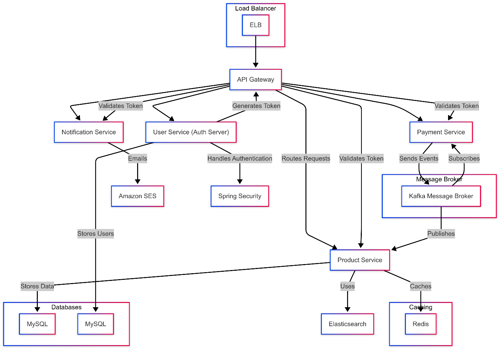
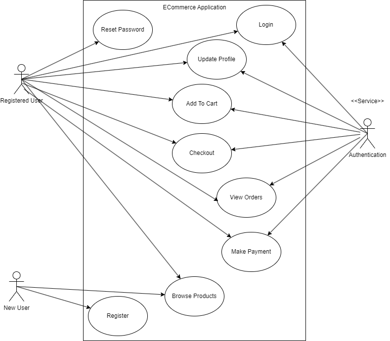

**Applied Software Project
Report**{width="2.2031255468066493in"
height="1.1545220909886265in"}

By

Vinay Goel

**A Master's Project Report submitted to Scaler Neovarsity - Woolf in
partial fulfillment of the requirements for the degree of Master of
Science in Computer Science**

March, 2025

{width="2.4166666666666665in"
height="1.359375546806649in"}

**Scaler Mentee Email ID:** goel.vinay5@gmail.com

**Thesis Supervisor:** Naman Bhalla

**Date of Submission:** 15/03/2025

**Certification**

I confirm that I have overseen / reviewed this applied project and, in
my judgment, it adheres to the appropriate standards of academic
presentation. I believe it satisfactorily meets the criteria, in terms
of both quality and breadth, to serve as an applied project report for
the attainment of Master of Science in Computer Science degree. This
applied project report has been submitted to Woolf and is deemed
sufficient to fulfill the prerequisites for the Master of Science in
Computer Science degree.

Naman Bhalla

.....................

Project Guide / Supervisor

**DECLARATION**

I confirm that this project report, submitted to fulfill the
requirements for the Master of Science in Computer Science degree,
completed by me from 15/01/2024 to 26/06/2024, is the result of my own
individual endeavor. The Project has been made on my own under the
guidance of my supervisor with proper acknowledgement and without
plagiarism. Any contributions from external sources or individuals,
including the use of AI tools, are appropriately acknowledged through
citation. By making this declaration, I acknowledge that any violation
of this statement constitutes academic misconduct. I understand that
such misconduct may lead to expulsion from the program and/or
disqualification from receiving the degree.

**Vinay Goel**

**Vinay Goel Date: 15 March 2025**

**ACKNOWLEDGMENT**

**I want to express gratitude to myself who helped, inspired or
motivated me to complete the program and earn the Master's degree**

**Table of Contents**

[**List of Tables 6**](#list-of-tables)

[**List of Figures 7**](#list-of-figures)

[**Applied Software Project 8**](#applied-software-project)

> [Abstract 8](#abstract)
>
> [Project Description 8](#_1z5fx61h0cc)
>
> [Requirement Gathering 9](#requirement-gathering)
>
> [Class Diagrams 9](#class-diagrams)
>
> [Database Schema Design 9](#database-schema-design)
>
> [Feature Development Process 11](#feature-development-process)
>
> [Deployment Flow 12](#deployment-flow)
>
> [Technologies Used 12](#technologies-used)
>
> [Conclusion 13](#conclusion)

[**References 14**](#references)

## List of Tables {#list-of-tables .unnumbered}

> **(To be written sequentially as they appear in the text)**

  --------- ---------------------------------------------- --------------
  **Table   **Title**                                      **Page No.**
  No.**                                                    

  **1**                                                    

  **2**                                                    
  --------- ---------------------------------------------- --------------

## List of Figures {#list-of-figures .unnumbered}

**(List of Images, Graphs, Charts sequentially as they appear in the
text)**

  ---------- ---------------------------------------------- --------------
  **Figure   **Title**                                      **Page No.**
  No.**                                                     

  **1**                                                     

  **2**                                                     
  ---------- ---------------------------------------------- --------------

## Applied Software Project {#applied-software-project .unnumbered}

### Abstract

### This project describes the design and implementation of a scalable and high-performance e-commerce platform based on a microservices architecture. The main goal is to give users an uninterrupted online shopping experience with high availability, security, and best performance. The platform includes key e-commerce features such as user management, browsing the product catalogue, shopping cart management, order processing, and secure payment processing. {#this-project-describes-the-design-and-implementation-of-a-scalable-and-high-performance-e-commerce-platform-based-on-a-microservices-architecture.-the-main-goal-is-to-give-users-an-uninterrupted-online-shopping-experience-with-high-availability-security-and-best-performance.-the-platform-includes-key-e-commerce-features-such-as-user-management-browsing-the-product-catalogue-shopping-cart-management-order-processing-and-secure-payment-processing. .unnumbered}

### In order to improve system scalability and efficiency, the architecture utilizes new cloud-based technologies like load balancers for request distribution, an API Gateway for routing, and Kafka for asynchronous messaging. The backend services make use of relational (MySQL) and NoSQL (MongoDB) databases to store structured data and flexible data, respectively. Elasticsearch is incorporated in the product catalogue service to support real-time search functionality with features such as typo correction. Also, Redis caching preloads highly accessed data to minimize latency when retrieving shopping carts. {#in-order-to-improve-system-scalability-and-efficiency-the-architecture-utilizes-new-cloud-based-technologies-like-load-balancers-for-request-distribution-an-api-gateway-for-routing-and-kafka-for-asynchronous-messaging.-the-backend-services-make-use-of-relational-mysql-and-nosql-mongodb-databases-to-store-structured-data-and-flexible-data-respectively.-elasticsearch-is-incorporated-in-the-product-catalogue-service-to-support-real-time-search-functionality-with-features-such-as-typo-correction.-also-redis-caching-preloads-highly-accessed-data-to-minimize-latency-when-retrieving-shopping-carts. .unnumbered}

### This system is architecturally designed to sustain high traffic loads and deliver a stable user experience via secure authentication, effective session management, and live order tracking. Independent scaling of services is made possible by the microservices-based model, making modifications and future development easy. Integrating contemporary software engineering practices and distributed computing concepts, this project helps shape the field of scalable and reliable e-commerce solutions. The suggested architecture can be utilized across sectors in order to enhance online retail businesses, streamline order fulfilment processes, and increase customer interaction through targeted shopping experiences. {#this-system-is-architecturally-designed-to-sustain-high-traffic-loads-and-deliver-a-stable-user-experience-via-secure-authentication-effective-session-management-and-live-order-tracking.-independent-scaling-of-services-is-made-possible-by-the-microservices-based-model-making-modifications-and-future-development-easy.-integrating-contemporary-software-engineering-practices-and-distributed-computing-concepts-this-project-helps-shape-the-field-of-scalable-and-reliable-e-commerce-solutions.-the-suggested-architecture-can-be-utilized-across-sectors-in-order-to-enhance-online-retail-businesses-streamline-order-fulfilment-processes-and-increase-customer-interaction-through-targeted-shopping-experiences. .unnumbered}

### Project Description

1.  Introduction

Digital commerce has revolutionized the interaction between consumers
and businesses, with e-commerce sites becoming a core component of
contemporary trade. The goal of this project is to create a scalable and
feature-loaded e-commerce website that facilitates effortless online
transactions. The site will include features like user authentication,
browsing of a product catalogue, management of shopping carts, order
placement, and secure payment.

2.  Objectives

The major objectives of the project are:

-   To develop and deploy a secure multi-user e-commerce platform.

-   To achieve a secure and scalable microservices architecture.

-   To include search and filtering functionalities for improved
    shopping.

-   To implement an efficient order management process, including
    notifications and tracking.

-   To make database performance efficient through Redis caching and
    Elasticsearch search indexing.

-   To enable secure payments through payment gateway integration.

    1.  Project Flow

The development process is in accordance with agile methodologies with
iterative enhancements. Following is the development life cycle:

{width="6.5in" height="3.25in"}+-

**Figure 2.3.1**: Project Development Process

2.  System Architecture

The system is based on a microservices architecture to maintain
modularity and scalability. Following is a simplified diagram of the
system architecture.

{width="6.5in" height="4.350694444444445in"}

Figure 2.4.1: E-commerce System Architecture

{width="6.5in" height="4.538194444444445in"}

Figure 2.4.2: E-commerce System Architecture

3.  Relevance and Real-world Applications

This e-commerce platform is applicable to businesses that want an online
presence and an automated order processing system. It is beneficial:

-   Retail companies: Allowing global access and efficient sales.

-   Customers: Providing a seamless, tailored shopping experience.

-   Logistics: Enabling order tracking and fulfilment.

-   Data Analytics: Capturing customer insights through tracking user
    behaviour.

    1.  Conclusion

The project will transform e-commerce by creating an effective, secure,
and easy-to-use shopping platform. The microservices architecture allows
scalability, which enables it to accommodate future development. Through
the application of current cloud-based technologies, this project will
make a large contribution to internet retailing, logistics, and customer
experience optimization.

### Requirement Gathering

2.  Functional Requirements

    1.  User Management

**User Registration**

-   The system shall allow new users to register using **email**

-   User account information should be securely stored following
    **industry-standard encryption**.

**Secure Login**

-   The system shall support **secure authentication** via
    email-password credentials

**Profile Management**

-   Users shall have the ability to **view, update, and manage** their
    personal information, including email, name, and contact details.

-   The system shall enforce **input validation and verification
    mechanisms** to prevent unauthorized modifications.

**Password Management**

-   Users must be able to **reset their passwords securely** through a
    verification link sent via email.

-   The system shall enforce **strong password policies** (e.g., minimum
    length, special characters).

    1.  Product Catalogue

**Product Browsing**:

-   Users should have the ability to explore products across various
    categories for easy discovery.

**Product Details**:

-   Each product page should display essential details, including
    images, descriptions, specifications, and other relevant attributes.

**Product Search**:

-   Users should be able to search products using keywords.

    1.   Cart & Checkout

**Add to Cart:**

-   Users should be able to select and add products to their shopping
    cart for future purchases.

**Cart Review:**

-   Users should have the ability to review selected items, including
    quantity, price breakdown, and total cost before proceeding to
    checkout.

**Checkout**:

-   The platform should provide a seamless checkout experience, allowing
    users to specify delivery details and select preferred payment
    methods.

1.  Order Management

**Order Confirmation:**

-   After making a purchase, users should receive a confirmation with
    order details.

**Order History:**

-   Users should be able to view their past orders.

**Order Tracking:**

-   Provide users with a way to track their order\'s delivery status.

    1.  Payment

**Multiple Payment Options:**

-   The system should support multiple payment methods, including
    credit/debit cards, online banking, and other widely used payment
    gateways.

**Secure Payment Processing:**

-   Transactions should be processed securely, ensuring the
    confidentiality and integrity of users\' financial data.

**Payment Receipt:**

-   After a successful transaction, users should receive a digital
    receipt confirming their payment.

    1.  Authentication

**Secure Authentication:**

-   Ensure that user data remains private and secure during login and
    throughout their session.

**Session Management:**

-   Users should remain logged in for a specified duration or until they
    decide to log out.

    1.  Non-Functional Requirements

**Security**

-   Implement **Spring Security** for authentication and authorization.

-   Encrypt sensitive data such as passwords using **BCrypt hashing**.

-   Ensure secure authentication mechanisms, including **OAuth2 and
    JWT-based authorization**.

-   Implement **role-based access control (RBAC)** to restrict
    unauthorized access to sensitive user data.

-   Apply **rate limiting** to prevent brute-force login attacks.

-   Apply **IP whitelisting** to prevent unauthorized access.

-   Prevent **SQL injection, XSS, and CSRF** attacks.

-   Payment data must be encrypted and comply with **PCI-DSS** security
    standards.

**Performance**

-   Ensure the services can handle **at least 1000 concurrent user
    requests** with minimal latency.

-   Optimize database queries and use **caching (e.g., Redis)** for
    frequently accessed user data.

-   Implement asynchronous processing where necessary using **messaging
    queues such as** **Kafka or RabbitMQ** to prevent blocking
    operations.

-   Product service must support **full-text search** and filtering
    using **Elasticsearch**.

**Scalability**

-   Deploy in a **containerized environment (Docker, Kubernetes)** for
    auto-scaling capabilities.

**Availability & Reliability**

-   Maintain **99.9% uptime** with load-balanced, multi-instance
    deployment.

-   Implement **circuit breakers** and **failover mechanisms** to handle
    service failures gracefully.

-   Provide **automated recovery mechanisms** for unexpected crashes.

-   Order and Payment Service must ensure **ACID compliance** for all
    financial transactions using a reliable RDBMS

-   Implement **idempotency mechanisms** to prevent duplicate order
    processing.

**Logging**

-   Enable **logging** for tracking user authentication and activity.

**Maintainability**

-   Implement **automated unit and integration tests** to ensure system
    stability.

```{=html}
<!-- -->
```
-   Maintain **well-documented API specifications** using
    OpenAPI/Swagger.

-   Unit and integration tests should achieve at least **80% code
    coverage**.

-   Implement CI/CD pipelines using GitHub Actions/Jenkins for automated
    deployments.

-   Code should adhere to industry best practices such as **SOLID
    principles and Design Patterns.**

-   All microservices must be deployed using Kubernetes (K8s) and
    Docker.

-   Services should support multi-region deployment for disaster
    recovery and high availability.

-   Database backups must be automated daily with retention for 30 days.

**Monitoring**

-   Use **structured logging (ELK Stack, Prometheus, or Grafana)** for
    system monitoring.

-   Services must expose health check endpoints (/health, /metrics) for
    monitoring via **Prometheus**.

    1.  Use Case Diagram

{width="4.984286964129484in"
height="4.364583333333333in"}

Figure 3.1.1: E-commerce Use Case Diagram

2.  Features

**Table 3.4:** Features Of E-Commerce Application

+-----------+---------------+-----------------------------------------+
| **        | **Feature**   | **Description**                         |
| Service** |               |                                         |
+===========+===============+=========================================+
| **User    | **User        | Allows new users to create an account   |
| Man       | R             | using their email or social media       |
| agement** | egistration** | profiles.                               |
|           |               |                                         |
|           |               | POST /register: Register a new user     |
+-----------+---------------+-----------------------------------------+
|           | **User        | Enables users to securely log in using  |
|           | Login**       | their credentials.                      |
|           |               |                                         |
|           |               | POST /login: Log in the user            |
+-----------+---------------+-----------------------------------------+
|           | **Profile     | Users can view, update, and manage      |
|           | Management**  | their personal details.                 |
|           |               |                                         |
|           |               | GET /profile: Retrieve user profile     |
|           |               |                                         |
|           |               | PUT /profile: Update profile            |
+-----------+---------------+-----------------------------------------+
|           | **Password    | Provides users with a secure way to     |
|           | Reset**       | reset their password via email          |
|           |               | verification.                           |
+-----------+---------------+-----------------------------------------+
| **Product | **Product     | Enables users to browse products across |
| Ca        | Browsing**    | different categories.                   |
| talogue** |               |                                         |
|           |               | GET /products: Get products by category |
+-----------+---------------+-----------------------------------------+
|           | **Product     | Displays product images, descriptions,  |
|           | Details**     | specifications, and relevant details.   |
|           |               |                                         |
|           |               | GET /products/{id}: Get detailed view   |
|           |               | of a product                            |
+-----------+---------------+-----------------------------------------+
|           | **Product     | Allows users to search for products     |
|           | Search**      | using keywords.                         |
|           |               |                                         |
|           |               | GET /search?query=keyword: Full-text    |
|           |               | search on product catalog               |
+-----------+---------------+-----------------------------------------+
| **Cart &  | **Add to      | Users can add selected products to      |
| C         | Cart**        | their cart for future purchase.         |
| heckout** |               |                                         |
|           |               | POST /cart: Add item to cart            |
+-----------+---------------+-----------------------------------------+
|           | **Cart        | Users can view their selected items,    |
|           | Review**      | adjust quantities, and check the total  |
|           |               | cost.                                   |
|           |               |                                         |
|           |               | GET /cart: Retrieve cart contents       |
|           |               |                                         |
|           |               | DELETE /cart/{itemId}: Remove item from |
|           |               | cart                                    |
+-----------+---------------+-----------------------------------------+
|           | **Checkout    | Facilitates a seamless checkout         |
|           | Process**     | experience, including delivery and      |
|           |               | payment selection.                      |
+-----------+---------------+-----------------------------------------+
| **Order   | **Order       | Users receive an order confirmation     |
| Man       | C             | with all relevant details.              |
| agement** | onfirmation** |                                         |
|           |               | POST /orders: Place an order            |
+-----------+---------------+-----------------------------------------+
|           | **Order       | Users can view a list of their past     |
|           | History**     | purchases.                              |
|           |               |                                         |
|           |               | GET /orders: View order history         |
+-----------+---------------+-----------------------------------------+
|           | **Order       | Provides real-time tracking updates for |
|           | Tracking**    | orders in transit.                      |
|           |               |                                         |
|           |               | GET /orders/{id}: Get order status      |
+-----------+---------------+-----------------------------------------+
| **        | **Multiple    | Supports credit/debit cards, online     |
| Payment** | Payment       | banking, and other payment gateways.    |
|           | Methods**     |                                         |
+-----------+---------------+-----------------------------------------+
|           | **Secure      | Ensures encrypted and secure payment    |
|           | T             | processing.                             |
|           | ransactions** |                                         |
|           |               | POST /payment: Process payment          |
+-----------+---------------+-----------------------------------------+
|           | **Payment     | Generates digital receipts after        |
|           | Receipt**     | successful transactions.                |
+-----------+---------------+-----------------------------------------+
| **Authent | **User        | Implements secure login mechanisms to   |
| ication** | Aut           | protect user data.                      |
|           | hentication** |                                         |
+-----------+---------------+-----------------------------------------+
|           | **Session     | Manages user sessions with defined      |
|           | Management**  | expiration and logout options.          |
+-----------+---------------+-----------------------------------------+

### Class Diagrams {#class-diagrams .unnumbered}

Describe the Low-Level Design of the Project...

Provide class diagrams - Provide proper captions and follow the proper
format for including diagrams / figures / images

**Tip** - Make images using draw.io and paste here following the
guidelines for adding images / figures

### Database Schema Design {#database-schema-design .unnumbered}

Explain the **Low Level Design** of the Project in more detail by
providing the **database schema**

**design** description

Provide the schema design textually as well as diagrammatically

Sample Schema Design described textually -

""

Tables:

Batches

-   Batch_id

-   Name

-   Start_month

-   Current_instructor

-   Batch_type_id

-   Primary Key(Batch_id)

Students

-   student_id

-   name

-   graduation_year

-   University_name

-   email

-   Phone_number

-   batch_id

-   Buddy_id

-   Primary Key(student_id)

Classes

-   Class_id

-   Name

-   Date

-   Time

-   Instructor

-   Primary Key(Class_id)

Mentors

-   Mentor_id

-   Name

-   Current_company

-   Primary Key(Mentor_id)

Mentor_Sessions

-   mentor_session_id

-   time

-   Duration

-   Student_id

-   Mentor_id

-   Student_rating

-   Mentor_rating

    -   Primary Key(mentor_session_id)

Batches_Classes

-   Batch_id

-   Class_id

-   Primary Key(Batch_id, Class_id)

Student_batch_history

-   student_id

-   batch_id

-   Shift_date

-   Primary Key(student_id, batch_id)

Batch_type

-   Batch_type_id

-   Batch_type

-   Primary Key(Batch_type_id)

**Foreign Keys:**

-   Batches(batch_type_id) refers Batch_type(batch_type_id)

-   Students(batch_id) refers Batches(batch_id)

-   Mentor_Sessions(Student_id) refers Students(Student_id)

-   Mentor_Sessions(Mentor_id) refers Mentors(Mentor_id)

-   Batches_Classes(Batch_id) refers Batches(batch_id)

-   Batches_Classes(student_id) refers Students(Student_id)

-   Student_batch_history(student_id) refers Students(Student_id)

-   Student_batch_history(batch_id) refers Batches(batch_id)

**Cardinality of Relations:**

-   Between Batches and Batch_type -\> m:1

-   Between Students and Batches -\> m:1

-   Between Batches and Classes -\> m:m

""

### Feature Development Process {#feature-development-process .unnumbered}

Pick One key feature - Talk about its development process,
implementation and performance optimisation / metric optimisation
achieved...

For example, 'Book a seat' feature in developing 'BookMyShow' app

Elaborate the request flow to backend

a.  API Request Payload

b.  Service which picks the request

c.  Flow of MVC architecture

Explain the performance improvement / metric optimization achieved.

For example,

-   Used Cache to reduce API Response time by X seconds...

-   Optimized Query Response time by using Indexing...

Benchmarking of response time without the optimisation and post the
optimisation

### Deployment Flow {#deployment-flow .unnumbered}

Explain how the deployment will work via AWS (Describe the below) -

-   EC2

-   VPC

-   Security Groups

-   RDS

-   Cache

-   Managed Infra / Elastic Beanstalk

Use diagrams, images to explain better

### Technologies Used {#technologies-used .unnumbered}

Kafka, MySQL, Springboot, Cloud etc...

-   For each key technology used in building the project,

    -   Detail and describe each of them

    -   Elaborate how they can be used in real life

    -   Provide example of real-life applications using them

Use diagrams, images to explain better

**Tip** - Use the internet to improve your project but DO NOT
PLAGIARIZE - Include proper references if you are quoting articles from
the internet

### Conclusion {#conclusion .unnumbered}

The Conclusion should include some key points as elaborated below -

-   Key Takeaways: Highlight the important concepts and technologies
    > learned from doing the Project

```{=html}
<!-- -->
```
-   Practical Applications : Significance of technologies with their
    > real-world applications

-   Limitations : Limitations of the technologies, cost implications and
    > suggestions for improvement

## References {#references .unnumbered}

Include the websites or works or the list of works referred to in a text
or consulted by you for writing this report

1.  Name of the Website, Date and time of referring to the Website, Name
    of the Author, Title/Topic

2.  Author Name, Title / Topic, Research Paper Name / Book Name, Year of
    Publication

Format Guidelines

1)  Detailed and Elaborate report of 40 pages at least is expected

2)  Margins - Every page of your document must meet the margin
    requirements of 1.25 inches on the left and right, and 1 inch on the
    top and bottom.

3)  Font:

    a.  Style: Times New Roman,

    b.  Font Size:14 (For Headings), 12 (For body text) in black colored
        text.

    c.  All text must be the same justification, like left justified or
        fully justified.

4)  Line Spacing:

    a.  Body of the text: 1.5

    b.  List of Tables/graphs/charts/bibliography: single line.

5)  Alignment:

    a.  Title page: Centre

    b.  Chapter Heading: Centre

    c.  Subheading: Left

    d.  Body of the text: Justify

6)  Titles: All titles and subtitles should be in bold. All
    tables/graphs/charts/figures should have appropriate titles.

7)  Numbering of the tables, charts, graphs should be in the following
    fashion: Second table/graph/chart in the second chapter should be
    numbered as Table/graph/chart no. 2.02; where the first digit stands
    for chapter no. and digits after (.) stands for number of
    table/graph/charts in that chapter. Same numbering should be
    followed for all other chapters.
