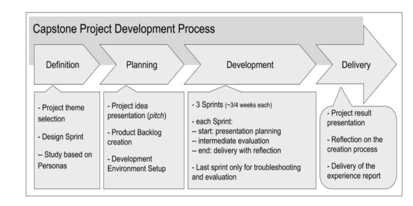
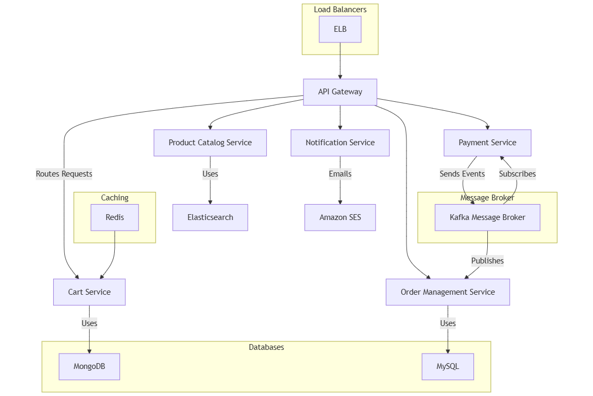

**Applied Software Project
Report**{width="2.2031255468066493in"
height="1.1545220909886265in"}

By

Vinay Goel

**A Master's Project Report submitted to Scaler Neovarsity - Woolf in
partial fulfillment of the requirements for the degree of Master of
Science in Computer Science**

October, 2024

{width="2.4166666666666665in"
height="1.359375546806649in"}

**Scaler Mentee Email ID :** goel.vinay5@gmail.com

**Thesis Supervisor :** Naman Bhalla

**Date of Submission :** 15/03/2025

**Certification**

I confirm that I have overseen / reviewed this applied project and, in
my judgment, it adheres to the appropriate standards of academic
presentation. I believe it satisfactorily meets the criteria, in terms
of both quality and breadth, to serve as an applied project report for
the attainment of Master of Science in Computer Science degree. This
applied project report has been submitted to Woolf and is deemed
sufficient to fulfill the prerequisites for the Master of Science in
Computer Science degree.

Naman Bhalla

.....................

Project Guide / Supervisor

**DECLARATION**

I confirm that this project report, submitted to fulfill the
requirements for the Master of Science in Computer Science degree,
completed by me from 15/01/2024 to 26/06/2024, is the result of my own
individual endeavor. The Project has been made on my own under the
guidance of my supervisor with proper acknowledgement and without
plagiarism. Any contributions from external sources or individuals,
including the use of AI tools, are appropriately acknowledged through
citation. By making this declaration, I acknowledge that any violation
of this statement constitutes academic misconduct. I understand that
such misconduct may lead to expulsion from the program and/or
disqualification from receiving the degree.

**Vinay Goel**

**Vinay Goel Date: 15 March 2025**

**ACKNOWLEDGMENT**

**I want to express gratitude to myself who helped, inspired or
motivated me to complete the program and earn the Master's degree**

**Table of Contents**

[**List of Tables 6**](#list-of-tables)

[**List of Figures 7**](#list-of-figures)

[**Applied Software Project 8**](#applied-software-project)

> [Abstract 8](#abstract)
>
> [Project Description 8](#_1z5fx61h0cc)
>
> [Requirement Gathering 9](#requirement-gathering)
>
> [Class Diagrams 9](#class-diagrams)
>
> [Database Schema Design 9](#database-schema-design)
>
> [Feature Development Process 11](#feature-development-process)
>
> [Deployment Flow 12](#deployment-flow)
>
> [Technologies Used 12](#technologies-used)
>
> [Conclusion 13](#conclusion)

[**References 14**](#references)

## List of Tables

> **(To be written sequentially as they appear in the text)**

  --------- ---------------------------------------------- --------------
  **Table   **Title**                                      **Page No.**
  No.**                                                    

  **1**                                                    

  **2**                                                    
  --------- ---------------------------------------------- --------------

## List of Figures

**(List of Images, Graphs, Charts sequentially as they appear in the
text)**

  ---------- ---------------------------------------------- --------------
  **Figure   **Title**                                      **Page No.**
  No.**                                                     

  **1**                                                     

  **2**                                                     
  ---------- ---------------------------------------------- --------------

## Applied Software Project

### Abstract

### This project describes the design and implementation of a scalable and high-performance e-commerce platform based on a microservices architecture. The main goal is to give users an uninterrupted online shopping experience with high availability, security, and best performance. The platform includes key e-commerce features such as user management, browsing the product catalog, shopping cart management, order processing, and secure payment processing.

### In order to improve system scalability and efficiency, the architecture utilizes new cloud-based technologies like load balancers for request distribution, an API Gateway for routing, and Kafka for asynchronous messaging. The backend services make use of relational (MySQL) and NoSQL (MongoDB) databases to store structured data and flexible data, respectively. Elasticsearch is incorporated in the product catalog service to support real-time search functionality with features such as typo correction. Also, Redis caching preloads highly accessed data to minimize latency when retrieving shopping carts.

### This system is architecturally designed to sustain high traffic loads and deliver a stable user experience via secure authentication, effective session management, and live order tracking. Independent scaling of services is made possible by the microservices-based model, making modifications and future development easy. Integrating contemporary software engineering practices and distributed computing concepts, this project helps shape the field of scalable and reliable e-commerce solutions. The suggested architecture can be utilized across sectors in order to enhance online retail businesses, streamline order fulfilment processes, and increase customer interaction through targeted shopping experiences.

### Project Description

Introduction

Digital commerce has revolutionized the interaction between consumers
and businesses, with e-commerce sites becoming a core component of
contemporary trade. The goal of this project is to create a scalable and
feature-loaded e-commerce website that facilitates effortless online
transactions. The site will include features like user authentication,
browsing of a product catalog, management of shopping carts, order
placement, and secure payment.

Objectives

The major objectives of the project are:

• To develop and deploy a secure multi-user e-commerce platform.

• To achieve a secure and scalable microservices architecture.

• To include search and filtering functionalities for improved shopping.

• To implement a efficient order management process, including
notifications and tracking.

• To make database performance efficient through Redis caching and
Elasticsearch search indexing.

• To enable secure payments through payment gateway integration.

Project Flow

The development process is in accordance with agile methodologies with
iterative enhancements. Following is the development life cycle:

Project Development Process

+\-\-\-\-\-\-\-\-\-\-\-\--+ +\-\-\-\-\-\-\-\-\-\-\--+
+\-\-\-\-\-\-\-\-\-\-\-\--+ +\-\-\-\-\-\-\-\-\-\-\--+

\| Definition \| \-\-\-\--\> \| Planning \| \-\-\-\--\> \| Development
\| \-\-\-\--\> \| Delivery \|

+\-\-\-\-\-\-\-\-\-\-\-\--+ +\-\-\-\-\-\-\-\-\-\-\--+
+\-\-\-\-\-\-\-\-\-\-\-\--+ +\-\-\-\-\-\-\-\-\-\-\--+

\| \| \| \|

V V V V

+\-\-\-\-\-\-\-\-\-\-\-\-\-\-\--+ +\-\-\-\-\-\-\-\-\-\-\-\-\-\-\--+
+\-\-\-\-\-\-\-\-\-\-\-\-\-\-\--+ +\-\-\-\-\-\-\-\-\-\-\-\-\-\-\--+

\| Project Theme \| \| Idea Presentation\| \| Sprint Planning\| \| Final
Demo \|

\| Selection \| \| & Pitch \| \| & Development \| \| & Report \|

+\-\-\-\-\-\-\-\-\-\-\-\-\-\-\--+ +\-\-\-\-\-\-\-\-\-\-\-\-\-\-\--+
+\-\-\-\-\-\-\-\-\-\-\-\-\-\-\--+ +\-\-\-\-\-\-\-\-\-\-\-\-\-\-\--+

\| \| \| \|

V V V V

+\-\-\-\-\-\-\-\-\-\-\-\-\-\-\--+ +\-\-\-\-\-\-\-\-\-\-\-\-\-\-\--+
+\-\-\-\-\-\-\-\-\-\-\-\-\-\-\--+ +\-\-\-\-\-\-\-\-\-\-\-\-\-\-\--+

\| Design Sprint \| \| Product Backlog \| \| Code Review \| \|
Reflection on \|

\| & Research \| \| & User Stories \| \| & Debugging \| \| Process \|

+\-\-\-\-\-\-\-\-\-\-\-\-\-\-\--+ +\-\-\-\-\-\-\-\-\-\-\-\-\-\-\--+
+\-\-\-\-\-\-\-\-\-\-\-\-\-\-\--+ +\-\-\-\-\-\-\-\-\-\-\-\-\-\-\--+

\| \| \| \|

V V V V

+\-\-\-\-\-\-\-\-\-\-\-\-\-\-\--+ +\-\-\-\-\-\-\-\-\-\-\-\-\-\-\--+
+\-\-\-\-\-\-\-\-\-\-\-\-\-\-\--+ +\-\-\-\-\-\-\-\-\-\-\-\-\-\-\--+

\| Personas Study\| \| Dev Environment \| \| Testing & QA \| \|
Deployment \|

\| & Problem \| \| Setup \| \| (Unit & Func) \| \| \|

\| Statement \| \| \| \| \| \| \|

+\-\-\-\-\-\-\-\-\-\-\-\-\-\-\--+ +\-\-\-\-\-\-\-\-\-\-\-\-\-\-\--+
+\-\-\-\-\-\-\-\-\-\-\-\-\-\-\--+ +\-\-\-\-\-\-\-\-\-\-\-\-\-\-\--+

Figure 1: Capstone Project Development Process

System Architecture

The system is based on a microservices architecture to maintain
modularity and scalability. Following is a simplified diagram of the
system architecture.

Architecture Diagram

{width="6.5in" height="7.938194444444444in"}

Figure 2: E-commerce System Architecture

Relevance and Real-world Applications

This e-commerce platform is applicable to businesses that want an online
presence and an automated order processing system. It is beneficial:

• Retail companies: Allowing global access and efficient sales.

• Customers: Providing a seamless, tailored shopping experience.

• Logistics: Enabling order tracking and fulfillment.

• Data Analytics: Capturing customer insights through tracking user
behavior.

6\. Conclusion

The project will transform e-commerce by creating an effective, secure,
and easy-to-use shopping platform. The microservices architecture allows
scalability, which enables it to accommodate future development. Through
the application of current cloud-based technologies, this project will
make a large contribution to internet retailing, logistics, and customer
experience optimization.

Describe the project, Outline the objectives and explain its relevance.

Use Pictures, flow diagrams to illustrate the project well

Use the below format as reference when including a picture

{width="6.5in" height="3.25in"}

**Figure 1.1**: Project Development Process (Figure captions go below
figures.)

### Requirement Gathering

-   Describe the requirements - Functional, Non-Functional Requirements

-   Describe the Users and Use Cases

    -   Include detailed Use Case Diagram / Images to illustrate

-   List and detail out the Feature set -

    -   Use Tables to list out the feature set

api-gateway - Entry point for routing requests to services

user-management - Handles user registration, login, etc.

product-catalog - Manages products, categories, search, etc.

cart-service - Manages shopping carts

order-management - Handles order processing, history, tracking

payment-service - Manages payment processing

notification-service - Sends notifications (emails/SMS)

common - Shared configurations and utilities (like Kafka configurations)

Use the below format as reference when including a table

**Table 1.1:** \< Table caption \> (Table captions go above tables.)

  ----------------------- ----------------------- -----------------------
                                                  

                                                  

                                                  
  ----------------------- ----------------------- -----------------------

### Class Diagrams

Describe the Low Level Design of the Project...

Provide class diagrams - Provide proper captions and follow the proper
format for including diagrams / figures / images

**Tip** - Make images using draw.io and paste here following the
guidelines for adding images / figures

### Database Schema Design

Explain the **Low Level Design** of the Project in more detail by
providing the **database schema**

**design** description

Provide the schema design textually as well as diagrammatically

Sample Schema Design described textually -

""

Tables:

Batches

-   Batch_id

-   Name

-   Start_month

-   Current_instructor

-   Batch_type_id

-   Primary Key(Batch_id)

Students

-   student_id

-   name

-   graduation_year

-   University_name

-   email

-   Phone_number

-   batch_id

-   Buddy_id

-   Primary Key(student_id)

Classes

-   Class_id

-   Name

-   Date

-   Time

-   Instructor

-   Primary Key(Class_id)

Mentors

-   Mentor_id

-   Name

-   Current_company

-   Primary Key(Mentor_id)

Mentor_Sessions

-   mentor_session_id

-   time

-   Duration

-   Student_id

-   Mentor_id

-   Student_rating

-   Mentor_rating

    -   Primary Key(mentor_session_id)

Batches_Classes

-   Batch_id

-   Class_id

-   Primary Key(Batch_id, Class_id)

Student_batch_history

-   student_id

-   batch_id

-   Shift_date

-   Primary Key(student_id, batch_id)

Batch_type

-   Batch_type_id

-   Batch_type

-   Primary Key(Batch_type_id)

**Foreign Keys:**

-   Batches(batch_type_id) refers Batch_type(batch_type_id)

-   Students(batch_id) refers Batches(batch_id)

-   Mentor_Sessions(Student_id) refers Students(Student_id)

-   Mentor_Sessions(Mentor_id) refers Mentors(Mentor_id)

-   Batches_Classes(Batch_id) refers Batches(batch_id)

-   Batches_Classes(student_id) refers Students(Student_id)

-   Student_batch_history(student_id) refers Students(Student_id)

-   Student_batch_history(batch_id) refers Batches(batch_id)

**Cardinality of Relations:**

-   Between Batches and Batch_type -\> m:1

-   Between Students and Batches -\> m:1

-   Between Batches and Classes -\> m:m

""

### Feature Development Process

Pick One key feature - Talk about its development process,
implementation and performance optimisation / metric optimisation
achieved...

For example, 'Book a seat' feature in developing 'BookMyShow' app

Elaborate the request flow to backend

a.  API Request Payload

b.  Service which picks the request

c.  Flow of MVC architecture

Explain the performance improvement / metric optimization achieved.

For example,

-   Used Cache to reduce API Response time by X seconds...

-   Optimized Query Response time by using Indexing...

Benchmarking of response time without the optimisation and post the
optimisation

### Deployment Flow

Explain how the deployment will work via AWS (Describe the below) -

-   EC2

-   VPC

-   Security Groups

-   RDS

-   Cache

-   Managed Infra / Elastic Beanstalk

Use diagrams, images to explain better

### Technologies Used

Kafka, MySQL, Springboot, Cloud etc...

-   For each key technology used in building the project,

    -   Detail and describe each of them

    -   Elaborate how they can be used in real life

    -   Provide example of real-life applications using them

Use diagrams, images to explain better

**Tip** - Use the internet to improve your project but DO NOT
PLAGIARIZE - Include proper references if you are quoting articles from
the internet

### Conclusion

The Conclusion should include some key points as elaborated below -

-   Key Takeaways: Highlight the important concepts and technologies
    > learned from doing the Project

```{=html}
<!-- -->
```
-   Practical Applications : Significance of technologies with their
    > real-world applications

-   Limitations : Limitations of the technologies, cost implications and
    > suggestions for improvement

## References

Include the websites or works or the list of works referred to in a text
or consulted by you for writing this report

1.  Name of the Website, Date and time of referring to the Website, Name
    of the Author, Title/Topic

2.  Author Name, Title / Topic, Research Paper Name / Book Name, Year of
    Publication

Format Guidelines

1)  Detailed and Elaborate report of 40 pages at least is expected

2)  Margins - Every page of your document must meet the margin
    requirements of 1.25 inches on the left and right, and 1 inch on the
    top and bottom.

3)  Font:

    a.  Style: Times New Roman,

    b.  Font Size:14 (For Headings), 12 (For body text) in black colored
        text.

    c.  All text must be the same justification, like left justified or
        fully justified.

4)  Line Spacing:

    a.  Body of the text: 1.5

    b.  List of Tables/graphs/charts/bibliography: single line.

5)  Alignment:

    a.  Title page: Centre

    b.  Chapter Heading: Centre

    c.  Subheading: Left

    d.  Body of the text: Justify

6)  Titles: All titles and subtitles should be in bold. All
    tables/graphs/charts/figures should have appropriate titles.

7)  Numbering of the tables, charts, graphs should be in the following
    fashion: Second table/graph/chart in the second chapter should be
    numbered as Table/graph/chart no. 2.02; where the first digit stands
    for chapter no. and digits after (.) stands for number of
    table/graph/charts in that chapter. Same numbering should be
    followed for all other chapters.
